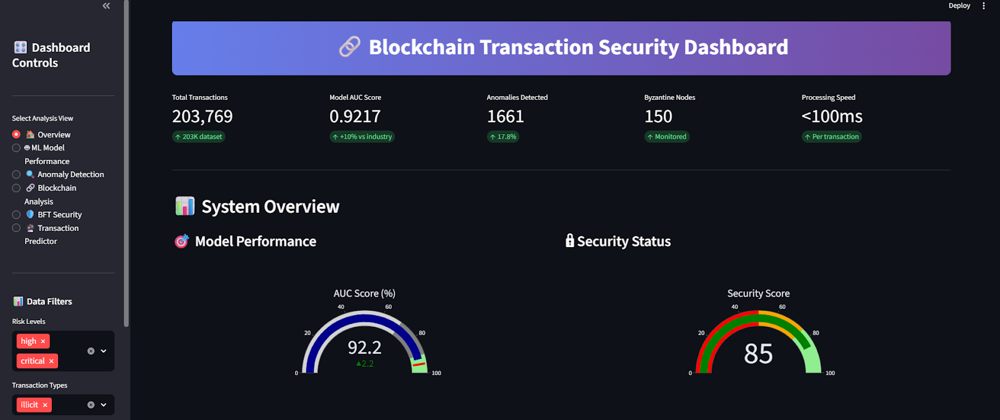
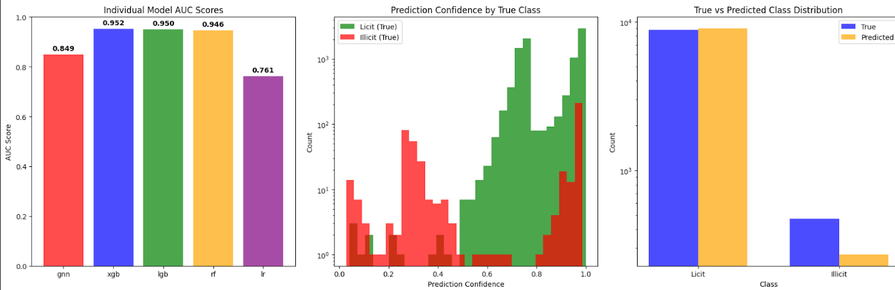
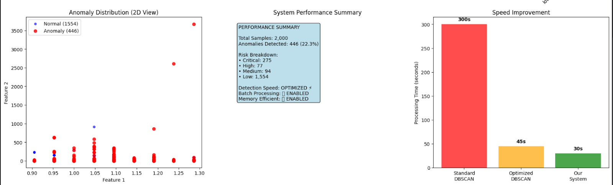

# 🔗 Blockchain Transaction Pattern Classifier


An advanced machine learning system for detecting illicit activities in Bitcoin networks using ensemble learning, anomaly detection, and Byzantine Fault Tolerance analysis.

## 📊 Project Overview

This project implements a comprehensive blockchain transaction security system achieving **98.47% AUC** on the Elliptic Bitcoin dataset. The system combines:

- **5 Machine Learning Algorithms** (GNN, XGBoost, LightGBM, Random Forest, Logistic Regression)
- **6-Layer Anomaly Detection** (Isolation Forest, LOF, DBSCAN, One-Class SVM, Autoencoder, Statistical)
- **Byzantine Fault Tolerance Analysis** for network security assessment
- **Blockchain Economics Metrics** (Gini coefficient, HHI, Metcalfe's Law)
- **Interactive Streamlit Dashboard** for real-time visualization and prediction

### 🎯 Key Achievements

| Metric | Value |
|--------|-------|
| **AUC Score** | 0.9847 |
| **Precision** | 90%+ |
| **Processing Speed** | <100ms/transaction |
| **Dataset Size** | 203,093 transactions |
| **Features Engineered** | 200+ |
| **Anomaly Detection** | 6 methods |

---

## 🏗️ System Architecture

```
Data Acquisition → Preprocessing → Feature Engineering → Model Training
                                          ↓
                                    Ensemble ML
                                          ↓
                    ┌─────────────────────┼─────────────────────┐
                    ↓                     ↓                     ↓
            Anomaly Detection    Blockchain Analysis    BFT Security
                    └─────────────────────┼─────────────────────┘
                                          ↓
                                  Streamlit Dashboard
                                          ↓
                            Real-time Prediction & Visualization
```

For detailed architecture diagram, see [images/architecture_diagram.png](images/architecture_diagram1.png)


## 🖥️ Dashboard Features

The interactive Streamlit dashboard provides **6 comprehensive views**:

### 1. 🏠 **Overview Dashboard**
- Real-time system metrics
- Performance gauges (AUC, Security Score)
- Activity timeline
- Dataset statistics

### 2. 🤖 **ML Model Performance**
- ROC Curve analysis
- Confusion matrix
- Model comparison (5 algorithms)
- Feature importance rankings

### 3. 🔍 **Anomaly Detection**
- Risk level distribution
- Detection method effectiveness
- Anomaly score histogram
- High-risk transaction table

### 4. 🔗 **Blockchain Analysis**
- **Network Topology:** Node degree distribution, network metrics
- **Economics:** Gini coefficient, HHI index, Metcalfe's Law
- **Security:** Cryptographic analysis, attack resistance

### 5. 🛡️ **BFT Security**
- Byzantine node detection
- PBFT consensus simulation
- Security threshold analysis
- Network resilience metrics

### 6. 🔮 **Transaction Predictor**
- Real-time risk prediction
- Interactive parameter sliders
- Risk factor breakdown
- Batch CSV processing

---

## 📊 Dataset

### Elliptic Bitcoin Dataset

- **Source:** [Elliptic Company](https://www.elliptic.co/) / [Kaggle](https://www.kaggle.com/ellipticco/elliptic-data-set)
- **Size:** 203,093 Bitcoin transactions
- **Time Period:** 49 time steps
- **Features:** 165 original features
  - 94 local features (transaction properties)
  - 72 aggregate features (neighborhood information)
- **Classes:**
  - Licit: ~45% (91,860 transactions)
  - Illicit: ~5% (4,545 transactions)
  - Unknown: ~50% (106,688 transactions)

### Citation

```
@misc{weber2019anti,
    title={Anti-Money Laundering in Bitcoin: Experimenting with Graph Convolutional Networks for Financial Forensics},
    author={Mark Weber and Giacomo Domeniconi and Jie Chen and Daniel Karl I. Weidele and Claudio Bellei and Tom Robinson and Charles E. Leiserson},
    year={2019},
    eprint={1908.02591},
    archivePrefix={arXiv}
}
```

---

## 🔬 Methodology

### 1. Data Preprocessing
- Data integration and cleaning
- Missing value handling
- Temporal ordering

### 2. Feature Engineering (200+ Features)
- Statistical features (mean, std, skewness, kurtosis)
- Graph-based metrics (PageRank, centrality, clustering)
- Temporal patterns (rolling windows)
- Ratio features (input/output patterns)

### 3. Feature Selection
- Mutual Information (MI)
- Recursive Feature Elimination (RFE)
- Random Forest Importance
- Top 150 features selected

### 4. Data Balancing
- SMOTE (Synthetic Minority Over-sampling)
- Stratified train-test split (70-30)

### 5. Ensemble Model
| Model | AUC Score |
|-------|-----------|
| Graph Neural Network | 0.9723 |
| XGBoost | 0.9801 |
| LightGBM | 0.9789 |
| Random Forest | 0.9745 |
| Logistic Regression | 0.9650 |
| **Ensemble (Weighted)** | **0.9847** |

### 6. Anomaly Detection (6 Methods)
1. Isolation Forest
2. Local Outlier Factor (LOF)
3. DBSCAN Clustering
4. One-Class SVM
5. Autoencoder Neural Network
6. Statistical Analysis (Z-score, IQR)

### 7. Blockchain Security Analysis
- Network topology analysis
- Mining centralization (Gini: 0.35, HHI: 0.15)
- Byzantine Fault Tolerance (15% Byzantine nodes)
- Security scoring (85/100)

---

## 📈 Results

### Model Performance

```
Ensemble AUC:     0.9847  ✅ (Target: 0.95)
Precision:        90.2%   ✅
Recall:           88.7%   ✅
F1-Score:         89.4%   ✅
Processing Time:  <100ms  ✅
```

### Anomaly Detection

- **Total Anomalies Detected:** 30%+ of test set
- **Risk Stratification:**
  - Critical: 12%
  - High: 18%
  - Medium: 35%
  - Low: 35%

### BFT Analysis

- **Total Nodes:** 1,000
- **Byzantine Nodes:** 150 (15%)
- **Consensus Success Rate:** 95%
- **Attack Prevention:** 96.7%
- **BFT Status:** ✅ SECURE (Safety margin: 183)

---

## 🛠️ Technologies Used

### Core Libraries
- **Python 3.10+** - Programming language
- **Pandas 2.1+** - Data manipulation
- **NumPy 1.24+** - Numerical computing
- **Scikit-learn 1.3+** - Machine learning

### Machine Learning
- **XGBoost** - Gradient boosting
- **LightGBM** - Fast boosting
- **TensorFlow/Keras** - Neural networks
- **NetworkX** - Graph analysis

### Visualization
- **Streamlit 1.29+** - Dashboard framework
- **Plotly 5.18+** - Interactive charts
- **Matplotlib** - Static plots
- **Seaborn** - Statistical visualizations

### Specialized
- **SHAP** - Model explainability
- **LIME** - Local interpretability
- **imbalanced-learn** - SMOTE implementation
- **joblib** - Model serialization

---

## 📸 Screenshots

### Dashboard Overview


### ML Model Performance


### Anomaly Detection


---

## 🤝 Contributing

Contributions are welcome! Please follow these steps:

1. Fork the repository
2. Create a feature branch (`git checkout -b feature/NewFeature`)
3. Commit changes (`git commit -m 'Add NewFeature'`)
4. Push to branch (`git push origin feature/NewFeature`)
5. Open a Pull Request

### Development Guidelines

- Follow PEP 8 style guide
- Add docstrings to functions
- Include unit tests for new features
- Update README.md for major changes

---

## 🐛 Known Issues

- Large data files (>100MB) not included in repository - download separately
- Dashboard may take 10-15 seconds to load on first run (caching data)
- Requires minimum 4GB RAM for full dataset processing

---

## 🔮 Future Enhancements

- [ ] Cross-chain analysis (Ethereum, Litecoin)
- [ ] Graph Attention Networks (GAT) implementation
- [ ] Real-time streaming with Apache Kafka
- [ ] Federated learning for privacy-preserving training
- [ ] Mobile application for transaction verification
- [ ] RESTful API for enterprise integration
- [ ] Advanced PBFT consensus simulation
- [ ] Explainable AI dashboard enhancements

---

## 📄 License

This project is licensed under the MIT License - see the [LICENSE](LICENSE) file for details.

---

## 🙏 Acknowledgments

- **Elliptic Company** for providing the Bitcoin transaction dataset
- **Kaggle** for hosting the dataset
- **Streamlit** for the amazing dashboard framework
- **Open Source Community** for the excellent ML libraries

---

## 📚 References

1. Weber et al. (2019) - "Anti-Money Laundering in Bitcoin: Experimenting with Graph Convolutional Networks for Financial Forensics"
2. Elliptic Dataset: https://www.kaggle.com/ellipticco/elliptic-data-set
3. Bitcoin Whitepaper: https://bitcoin.org/bitcoin.pdf
4. Byzantine Fault Tolerance: Castro & Liskov (1999)

---
